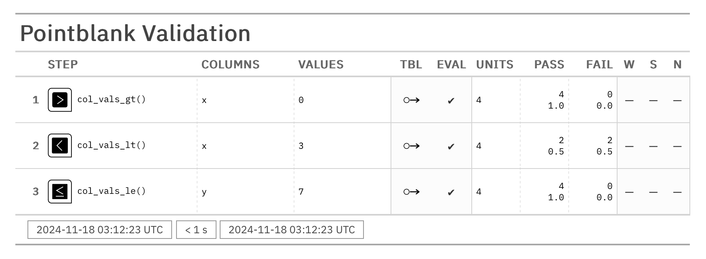

# pointblank

Find out if your data is what you think it is

## Introduction

`pointblank` is a table validation and testing library for Python. It helps you ensure that your tabular data meets certain expectations and constraints, making it easier to catch data quality issues early in your data pipeline. There are two main workflows that are supported:

1. **Data Validation and Reporting**: Use the `Validate` class to validate your data against a set of constraints and generate a report of the results.

2. **Data Testing**: Use the `Test` class to write tests for your data and use them in notebook code or in a testing framework like `pytest`.

These workflows make it possible to catch data quality issues early in your data pipeline, and to ensure that your data meets the expectations of your downstream consumers. Presently, Pandas and Polars DataFrames can be used with `pointblank`; we make use of the `Narwhals` library since it provides a flexible and powerful API for working with tabular data.

## Features

- **Declarative Syntax**: Define your data constraints using a simple, declarative syntax.
- **Flexible**: Use Polars or Pandas dataframes as input (we use Narwhals under the hood to support both).
- **Beautiful Reports**: Generate beautiful HTML reports of your data validation results.
- **Functional Output**: Get JSON output of your data validation results for further processing.
- **Data Testing**: Write tests for your data and use them in your notebooks or testing framework.
- **Easy to Use**: Get started quickly with a simple API and clear documentation.
- **Powerful**: You can develop complex data validation rules with fleixble options for customization.

## Example Use Cases

Let's say you have a Polars DataFrame and you want to validate it against a set of constraints. Here's how you can do that using the `pb.Validate` class and its library of validation methods:

```python
import pointblank as pb
import polars as pl

# Create a Polars DataFrame
tbl_pl = pl.DataFrame({"x": [1, 2, 3, 4], "y": [4, 5, 6, 7]})

# Validate data using Polars DataFrame
v = (
    pb.Validate(data=tbl_pl) # Add data to be validated
    .col_vals_gt(column="x", value=0) # STEP 1 |
    .col_vals_lt(column="x", value=3) # STEP 2 | <-- The validation plan
    .col_vals_le(column="y", value=7) # STEP 3 |
    .interrogate() # This will execute all validation steps
)

# Get JSON for the validation
json_output = v.report_as_json()
print(json_output)
```

```python
[
    {
        "i": 1,
        "assertion_type": "col_vals_gt",
        "column": "x",
        "values": 0,
        "inclusive": null,
        "na_pass": false,
        "pre": null,
        "thresholds": "Thresholds(warn_at=None, stop_at=None, notify_at=None)",
        "label": null,
        "brief": null,
        "active": true,
        "all_passed": true,
        "n": 4,
        "n_passed": 4,
        "n_failed": 0,
        "f_passed": 1.0,
        "f_failed": 0.0,
        "warn": null,
        "stop": null,
        "notify": null,
        "time_processed": "2024-11-18T03:12:23.346+00:00",
        "proc_duration_s": 0.028995
    },
    {
        "i": 2,
        "assertion_type": "col_vals_lt",
        "column": "x",
        "values": 3,
        "inclusive": null,
        "na_pass": false,
        "pre": null,
        "thresholds": "Thresholds(warn_at=None, stop_at=None, notify_at=None)",
        "label": null,
        "brief": null,
        "active": true,
        "all_passed": false,
        "n": 4,
        "n_passed": 2,
        "n_failed": 2,
        "f_passed": 0.5,
        "f_failed": 0.5,
        "warn": null,
        "stop": null,
        "notify": null,
        "time_processed": "2024-11-18T03:12:23.347+00:00",
        "proc_duration_s": 0.000377
    },
    {
        "i": 3,
        "assertion_type": "col_vals_le",
        "column": "y",
        "values": 7,
        "inclusive": null,
        "na_pass": false,
        "pre": null,
        "thresholds": "Thresholds(warn_at=None, stop_at=None, notify_at=None)",
        "label": null,
        "brief": null,
        "active": true,
        "all_passed": true,
        "n": 4,
        "n_passed": 4,
        "n_failed": 0,
        "f_passed": 1.0,
        "f_failed": 0.0,
        "warn": null,
        "stop": null,
        "notify": null,
        "time_processed": "2024-11-18T03:12:23.347+00:00",
        "proc_duration_s": 0.000315
    }
]
```

To make this more readable, you can generate an HTML report of the validation results with the `report_as_html` method:

```python
# Get an HTML report of the validation
html_report = v.report_as_html()
html_report # <-- This will display the HTML report in a notebook
```



## Installation

You can install `pointblank` using pip:

```bash
pip install pointblank
```
